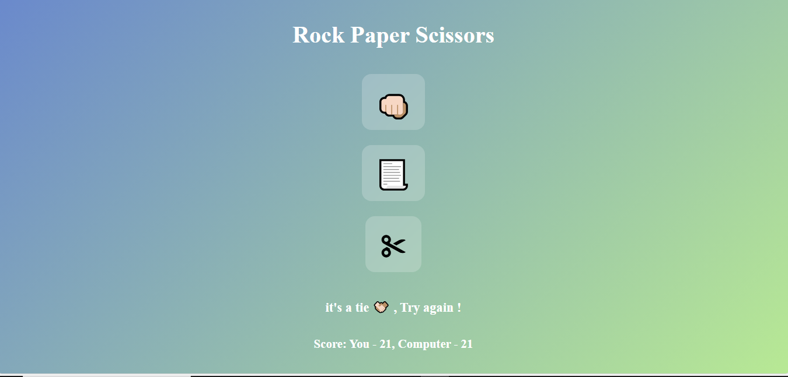

# Rock Paper Scissors Game

A simple, interactive, and responsive **Rock Paper Scissors** game built using **HTML, CSS, and JavaScript**. This project demonstrates DOM manipulation, event handling, game logic, and responsive UI design using modern CSS units such as `rem`, `vh`, and `%`.

---

## ✨ Features

- Classic Rock-Paper-Scissors gameplay
- Modern and clean responsive UI
- Emoji-based player and computer choices
- Smooth hover animation on buttons
- Real-time score updates
- Random computer selection
- Fully mobile-friendly design

---

## 🛠️ Tech Stack

- HTML5  
- CSS3  
- JavaScript (ES6)

---
## 📜 Game Logic Overview

- User selects Rock, Paper, or Scissor.
- Computer picks a random value from an array.
- Winner is decided based on classic RPS rules:
- Rock beats Scissor  
- Paper beats Rock  
- Scissor beats Paper  
- Score updates dynamically.

## 🎮 Live Demo
(https://rock-paper-scissor-mini-game.netlify.app/)

---

## 📸 Screenshot

---

## How to Run the Project

1. Download or clone the repository
2. Open the folder
3. Simply open **index.html** in any browser
4. No installation or server required

---

## Author

Developed by **Ayesha Noor**.

---

If you like this project, consider giving the repo a ⭐ on GitHub!

